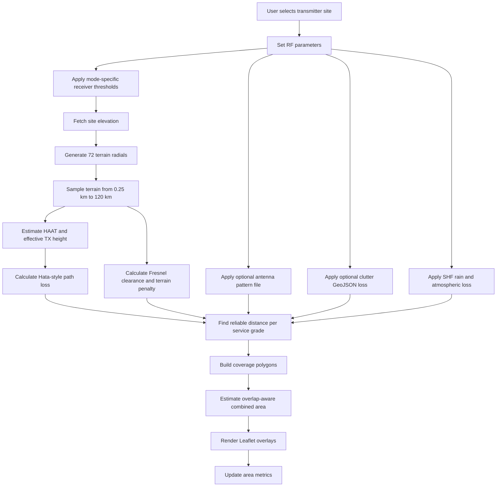

<p align="center">
  
</p>

<h1 align="center">9M2PJU Coverage Prediction</h1>

<p align="center">
  <strong>Multi-Site Terrain-Aware RF Coverage Prediction for Amateur Radio</strong>
</p>

<p align="center">
  
  
  
  
  
  
</p>

<p align="center">
  
  
  
  
  
</p>

---

## Overview

**9M2PJU Coverage Prediction** is a browser-based RF coverage planning tool for amateur radio operators. It predicts practical signal coverage from one or more transmitter sites by combining radio path loss, transmitter parameters, antenna height, receiver height, terrain elevation, and map-based visualization.

[**Launch v4.7.0 Dashboard**](https://coverage.hamradio.my)

The app is designed for fast field planning: choose a transmitter location, adjust RF parameters, run the prediction, and inspect the expected strong, moderate, and fringe coverage zones directly on a map.

This app uses the self-hosted 9M2PJU NTIA ITM / Longley-Rice API as its default propagation model, with Hata/COST-style and ITM-style local fallback models, sampled terrain/Fresnel obstruction, optional clutter polygons, optional antenna pattern files, SHF rain/atmospheric attenuation, and local measurement calibration. It should give useful planning-grade coverage zones, but real-world results can still differ due to building-level obstructions, foliage detail, local noise, receiver quality, weather, terrain data accuracy, and antenna installation quality.

---

## What Changed in v4.7.0

- Labeled this release as **Self Hosted ITM Integrated version**.
- Added **Self-hosted NTIA ITM** as the default engineering model using `https://itm.hamradio.my`.
- Integrated the `/itm/radial` API into coverage polygon generation for native Longley-Rice path-loss samples.
- Added visible ITM API status in the engineering model panel.
- Kept local ITM-style fallback when the API is unavailable or frequency is above the NTIA ITM 20 GHz limit.
- Added ITM API URL/status metadata to exported validation reports.
- Updated project metadata to version `4.7.0`.

## What Changed in v4.6.0

- Labeled this release as **Latest Stable by 9M2PJU**.
- Hardened RF prediction by preventing path loss from dropping below free-space loss.
- Reworked VHF/UHF path-loss handling into Hata, COST-231-style high-UHF, and clearly marked extrapolated planning ranges.
- Made radial coverage detection more conservative by using the first continuous failure point.
- Added model reliability notes to the UI and validation report.
- Added optional antenna pattern CSV import for real measured or manufacturer pattern loss/gain data.
- Added optional GeoJSON clutter-loss polygons for local building, forest, or obstruction loss zones.
- Added SHF rain-rate and atmospheric-loss controls for microwave planning.
- Added local measurement calibration from imported signal reports.
- Changed combined multi-site area totals to estimate overlap-aware union area instead of simple summed area.
- Added automated RF smoke tests for formula guardrails.
- Updated project metadata to version `4.6.0`.

## What Changed in v4.5.2

- Labeled the release as **Latest Stable by 9M2PJU**.
- Hardened RF prediction by preventing path loss from dropping below free-space loss.
- Reworked VHF/UHF path-loss handling into Hata, COST-231-style high-UHF, and clearly marked extrapolated planning ranges.
- Made radial coverage detection more conservative by using the first continuous failure point.
- Added model reliability notes to the UI and validation report.
- Updated project metadata to version `4.5.2`.

## What Changed in v4.5.1

- Renamed the app to **9M2PJU Coverage Prediction**.
- Updated the subtitle to **Multi-Site Coverage Prediction v4.5.1**.
- Added support for up to 4 transmitter coverage sites.
- Added combined coverage metrics across all active sites.
- Added multiple base map layers while keeping standard OpenStreetMap as the default.
- Improved the RF prediction model with receiver height, effective antenna height, HAAT, terrain clearance, and diffraction-style loss.
- Added an engineering mode framework with selectable enhanced Hata or ITM-style hybrid planning, clutter profiles, feedline loss, receiver gain, noise figure, fade margin, directional antenna pattern settings, confidence estimates, measurement import, and validation report export.
- Reworked the mobile and desktop layout for better browser compatibility.
- Added PWA metadata and offline app-shell caching for install support on mobile and desktop browsers.
- Fixed generated bundle linting by excluding deployed `docs/` output from ESLint.
- Updated project metadata to version `4.5.1`.

---

## Main Features

### Multi-Site Prediction

The app can model multiple transmitter sites in the same planning session. Each site has:

- A map marker position.
- Site elevation.
- HAAT estimate.
- Strong, moderate, and fringe coverage polygons.
- Individual area totals.

The dashboard also shows combined area totals across all sites. Combined totals now use an overlap-aware grid union estimate, so overlapping coverage is counted once instead of being simply summed per site.

### Terrain-Aware Coverage

The prediction does more than draw a simple radius circle. For each transmitter site, the app samples terrain in 72 radial directions and evaluates signal reach along each radial. Terrain that intrudes into the signal path adds a penalty, reducing coverage in blocked directions.

### RF Controls

The model responds to:

- Mode profile, including FM voice, APRS/packet, SSB/weak signal, and LoRa SF7/SF9/SF12 presets.
- Propagation model profile, including enhanced Hata plus terrain and an ITM-style hybrid approximation.
- Clutter profile for open/rural, suburban, forest/foliage, and dense urban assumptions.
- TX power from 0.1 W to 100 W.
- Antenna gain in dBi.
- Directional antenna azimuth, beamwidth, and front-to-back ratio.
- Optional antenna pattern CSV import using angle/lossDb or angle/gain_dBi columns.
- Feedline loss, receiver antenna gain, receiver noise figure, required SNR, receiver bandwidth, and fade margin.
- Optional GeoJSON clutter-loss polygons using properties such as `lossDb`, `loss_db`, `clutterLoss`, or `rf_loss_db`.
- SHF rain rate and atmospheric loss controls for 3-30 GHz paths.
- Receiver height above ground from 1 m to 30 m.
- Mode-specific receiver bandwidth and required SNR defaults.
- VHF, UHF, and SHF band selectors with exact frequency control from 30 MHz to 30 GHz.
- Tower height above ground from 0 m to 300 m.
- Site elevation and surrounding terrain.

### Field Validation

The app can import field measurements from CSV or GPX files and compare measured signal levels against predicted coverage zones. CSV files should include latitude, longitude, and signal columns such as:

```text
lat,lon,rssi
3.1390,101.6869,-82
```

GPX imports read `trkpt` or `wpt` coordinates and look for signal values in extension fields named `rssi`, `signal`, `signal_dbm`, `dbm`, or `rx_dbm`. After import, the app shows validation markers on the map and can export a JSON validation report with model assumptions, prediction class, measured dBm, calculated predicted dBm at each measurement point, error, RMSE, median absolute error, and within-6/within-10 dB statistics.

When at least 3 matched field measurements are available, the app can apply a local calibration offset from measured prediction bias. This does not change the physics model; it tunes the practical prediction for the current area, antenna installation, receiver chain, and local RF environment.

### Map Layers

Standard OpenStreetMap is the default base layer. The layer switcher also includes:

- OpenStreetMap Humanitarian.
- OpenTopoMap Terrain.
- Esri World Imagery.
- Carto Dark.

---

## How Prediction Works

The prediction flow is:



### 1. Terrain Sampling

For each transmitter site, the app generates 72 bearings around the site. Along each bearing it samples terrain at:

`0.25, 0.5, 1, 2, 4, 6, 8, 10, 12, 16, 24, 32, 48, 64, 96, and 120 km`

Elevation data is fetched from the Open-Elevation API in batches.

### 2. HAAT and Effective Height

The app estimates Height Above Average Terrain using the 3-16 km sampled terrain ring around the transmitter. It then derives an effective transmitter height from:

```text
effective height = max(tower height, antenna AMSL - average 3-16 km terrain)
```

This makes a hilltop site behave differently from a site surrounded by higher terrain without double-counting tower height.

### 3. Path Loss

For VHF and lower UHF, the base RF model uses an Okumura-Hata style suburban path loss calculation:

```text
Lb = 69.55 + 26.16 log10(f) - 13.82 log10(hTx)
     - a(hRx) + [44.9 - 6.55 log10(hTx)] log10(d)
```

Where:

- `f` is frequency in MHz.
- `hTx` is effective transmitter height in meters.
- `hRx` is receiver height in meters.
- `d` is distance in kilometers.
- `a(hRx)` is the receiver height correction factor.

The implementation now keeps path loss at or above free-space path loss so short paths and extrapolated model ranges cannot become physically over-optimistic. It uses the Hata-style suburban form from 150-1500 MHz, a COST-231-style high-UHF extension from 1500-2000 MHz, an explicitly marked extrapolation from 2000-3000 MHz, and a SHF line-of-sight planning approximation above 3000 MHz based on free-space path loss plus a practical excess-loss margin. Terrain, curvature/refraction, and Fresnel clearance are still applied separately.

### 4. Terrain Penalty

For each candidate distance, the app checks an interpolated terrain profile along the path:

- It estimates the line-of-sight height between transmitter and receiver.
- It applies 4/3-earth effective-radius curvature/refraction correction.
- It estimates first Fresnel zone clearance.
- If terrain violates the required clearance, it applies a diffraction-style loss penalty.
- Multiple obstructed samples add extra shadowing loss.

This creates shorter coverage in blocked directions and longer coverage in clearer directions.

### 4b. Engineering Adjustments

The v4.7.0 engineering framework extends the link budget with:

```text
usable budget = TX dBm + TX antenna gain + RX antenna gain
                - feedline loss - fade margin - receiver threshold
```

Directional antennas reduce gain outside the selected beamwidth using either the manual beamwidth/front-to-back approximation or an imported CSV pattern file. Clutter profiles add practical environment loss and uncertainty, and optional GeoJSON clutter polygons add local obstruction loss along the path. Receiver bandwidth, noise figure, and required SNR can raise the effective receiver threshold when the noise-limited threshold is higher than the mode preset.

For SHF and microwave planning, the app can add rain-rate attenuation and atmospheric loss per kilometer. These controls are intentionally exposed because Malaysia-style heavy rain can matter on high-SHF paths, while VHF/UHF paths should not be penalized by microwave rain fading.

The ITM-style hybrid profile is not a full Longley-Rice implementation. It combines free-space path loss, Hata-style loss, terrain roughness, radio-horizon loss, and existing Fresnel/diffraction penalties to behave more conservatively over rough or beyond-horizon paths. It is included as a browser-friendly engineering approximation until a full ITM/Longley-Rice engine or service is connected.

The first Fresnel zone radius is calculated in meters with frequency in MHz:

```text
F1 = 548 sqrt(d1 d2 / (f D))
```

Where:

- `d1` and `d2` are the path segment distances in kilometers.
- `D` is the full path distance in kilometers.
- `f` is frequency in MHz.

The model expects at least 60% of the first Fresnel zone to be clear. If terrain violates that clearance, it applies a knife-edge diffraction-style loss:

```text
v = h sqrt(2 (d1 + d2) / (lambda d1 d2))
J(v) = 6.9 + 20 log10(sqrt((v - 0.1)^2 + 1) + v - 0.1)
```

Where `h` is the clearance deficit in meters after interpolated terrain and 4/3-earth curvature/refraction correction, `lambda` is wavelength in meters, and `d1`/`d2` are converted to meters for the diffraction calculation. The app also adds a small extra shadowing penalty for multiple obstructed terrain profile points.

### 5. Mode Profiles and Service Grade Thresholds

The app searches outward along each radial and uses the first continuous failure point where total loss exceeds each mode-specific service-grade budget. That is more conservative than simply finding the farthest mathematical pass, because a blocked section along the path should shorten the reliable coverage contour. FM voice keeps the original practical voice-planning thresholds:

| Grade | Threshold | Typical Use |
| :--- | :--- | :--- |
| Strong | > -93 dBm | Handheld / reliable audio |
| Moderate | > -105 dBm | Mobile / usable field coverage |
| Fringe | > -115 dBm | Weak signal / base station reception |

Other profiles replace those thresholds with receiver-sensitivity-oriented values. Selecting a mode also applies matching receiver bandwidth and required SNR defaults, so LoRa SF7/SF9/SF12 use 125 kHz bandwidth with spreading-factor-appropriate SNR assumptions:

| Mode | Strong | Moderate | Fringe |
| :--- | :--- | :--- | :--- |
| APRS / Packet | > -100 dBm | > -108 dBm | > -116 dBm |
| SSB / Weak Signal | > -105 dBm | > -115 dBm | > -123 dBm |
| LoRa SF7 125k | > -103 dBm | > -113 dBm | > -123 dBm |
| LoRa SF9 125k | > -109 dBm | > -119 dBm | > -129 dBm |
| LoRa SF12 125k | > -117 dBm | > -127 dBm | > -137 dBm |

Each grade becomes a polygon built from the predicted distance in each radial direction.

### 6. Formula Audit and Reliability

The current formula set is suitable for comparative planning and field pre-checks, not for certified RF engineering sign-off. The calculation path has been checked for unit consistency, uses the correct MHz form of the first Fresnel radius formula, prevents path loss from dropping below free-space loss, and marks model reliability in the UI and validation report.

What is considered reliable enough for planning:

- TX power is converted with `Ptx dBm = 10 log10(Pwatts * 1000)`.
- Antenna gain is added directly to the link budget as dBi.
- Coverage is found where `path loss + terrain penalty` stays below `Ptx dBm + antenna gain - receiver threshold`, using the first continuous radial failure point as the coverage edge.
- Optional imported antenna pattern loss is applied per radial bearing.
- Optional mapped clutter loss, SHF rain attenuation, atmospheric loss, feedline loss, receiver gain, fade margin, and local calibration are included in the same link-budget calculation path used for polygons and validation reports.
- Combined multi-site coverage area is estimated with an overlap-aware grid union, so duplicate overlapped coverage is reduced.
- Free-space path loss is the minimum allowed path loss for every band.
- The Hata-style suburban path loss equation matches the common Okumura-Hata form and suburban correction in its strongest 150-1500 MHz planning range.
- COST-231-style high-UHF handling is used around 1500-2000 MHz, while 2000-3000 MHz is treated as an extrapolated high-UHF planning range.
- SHF uses free-space path loss plus terrain, curvature/refraction, Fresnel clearance, and a practical SHF excess-loss margin instead of extending Hata beyond its useful range.
- The terrain penalty uses interpolated line-of-sight clearance, 4/3-earth curvature/refraction correction, 60% first Fresnel clearance, and a knife-edge diffraction-style loss approximation.
- LoRa, APRS, SSB, and FM profiles are modeled by changing receiver threshold/link-margin bands, not by changing the propagation physics.

Known reliability limits:

- Okumura-Hata is empirical. It is strongest for macro-style outdoor links, not indoor handheld operation or street-canyon/building-level prediction.
- The ITM-style hybrid mode is an approximation inspired by Longley-Rice/ITM behavior, not a certified ITM implementation.
- The original Hata model is normally bounded around 150-1500 MHz, base antenna heights around 30-200 m, mobile heights around 1-10 m, and moderate link distances. The app warns when frequency or antenna heights move outside those ranges.
- COST-231-style handling is strongest around 1500-2000 MHz. Predictions above 2000 MHz and below 150 MHz are planning extrapolations and should be calibrated with field measurements.
- SHF support from 3-30 GHz is a practical line-of-sight planning approximation, not a full ITU-R P.452/P.530, Longley-Rice/ITM, rain-fade, or ray-tracing implementation.
- SHF rain and atmospheric loss controls are planning approximations, not a full ITU-R P.838/P.530 availability model.
- Terrain is sampled at fixed radial distances out to 120 km and interpolated at 0.5 km clearance intervals. Very small terrain features between sample points, especially buildings and near-street obstructions, can still be missed.
- Imported clutter polygons are only as good as the supplied local GeoJSON and loss values. The app does not bundle building/foliage datasets.
- Imported antenna pattern files are interpolated by bearing. They do not model tilt, polarization, mounting interaction, or mast/tower distortion.
- Overlap-aware combined area is a grid estimate, not exact computational geometry.
- The LoRa presets use typical sensitivity-style thresholds for SF7/SF9/SF12 at 125 kHz. Real LoRa reliability also depends on bandwidth, coding rate, payload length, interference, duty cycle, receiver implementation, and local regulations.
- Polarization mismatch, receiver desense, local interference, indoor penetration, and street-level multipath are not fully modeled.

For critical deployments, use this tool to choose candidate sites and then validate with field measurements or a regulatory-grade RF planning package.

---

## Notes and Limitations

- This is a planning and prediction tool, not a certified engineering survey.
- Open-Elevation API availability and CORS behavior can affect local development.
- Full Longley-Rice/ITM, ITU-R P.452/P.530, ray tracing, and bundled building/foliage datasets are not included yet.
- Real-world validation with field measurements is still recommended.

## Verification

Run the project checks before release:

```bash
npm run test:rf
npm run lint
npm run build
```

`npm run test:rf` checks key RF guardrails, including free-space path-loss floors and SHF rain-loss behavior.

## Self-Hosted ITM / Longley-Rice API

The repository includes a standalone Docker service in [`itm-longley-rice/`](itm-longley-rice/) for self-hosting an NTIA ITM / Longley-Rice API. On a server:

```bash
cd itm-longley-rice
docker compose up -d --build
```

After it is public, use `http://SERVER_IP:8787/health` to confirm it is running, then provide the URL so the web app can be configured to call it.

---

## Technology Stack

- **Core**: React, Vite
- **Mapping**: Leaflet, React-Leaflet
- **Elevation Data**: Open-Elevation API
- **UI**: Vanilla CSS, responsive desktop/mobile layout
- **Icons**: Lucide React
- **Deployment**: GitHub Pages via `docs/`

---

<p align="center">
  
  <br>
  Built for the Amateur Radio Community by <b>9M2PJU</b>
  <br>
  <a href="https://github.com/9M2PJU">GitHub Profile</a>
</p>
