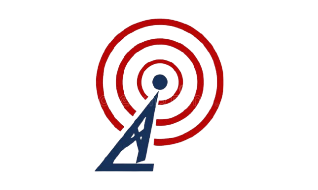
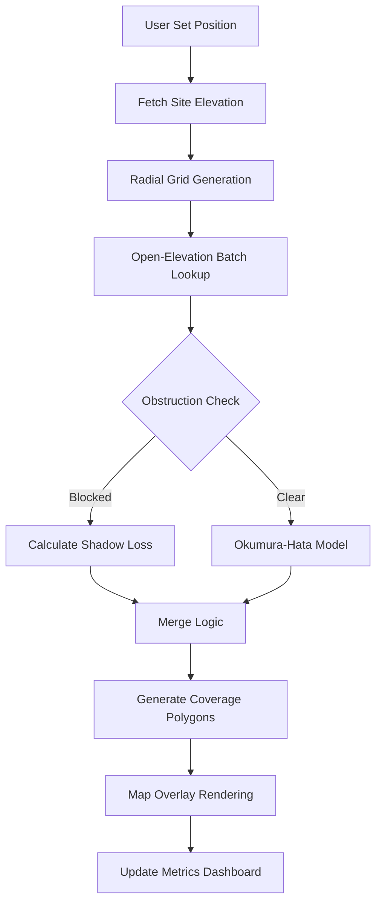

  

<h1 align="center">9M2PJU PRO SIGNAL</h1>

  <strong>Terrain-Aware RF Coverage Analysis Dashboard</strong>

  
  
  
  

---

## 📡 Overview

**9M2PJU PRO SIGNAL** is a professional-grade web application designed for amateur radio operators to perform high-precision signal coverage analysis. By combining high-resolution terrain data with industry-standard propagation models, it provides a realistic "Radio Mobile" style experience directly in your browser.

[**Launch Live App 🚀**](https://coverage.hamradio.my)

---

## ✨ Key Features

### 🏔️ Terrain-Aware Analysis
Uses the **Open-Elevation API** to sample real-time topographic data. The engine performs a 72-radial "spoke" scan, checking for terrain obstructions (Knife-Edge Blocking) along every signal path.

### 📱 Mobile Native App Experience
Optimized for the field. On mobile devices, the app transforms into a native-feeling interface:
- **Bottom Sheet Controls**: Slide settings up and down with touch gestures.
- **Floating Action Button (FAB)**: Quick-access scanning button.
- **Swipeable Metrics**: View signal area cards at a glance.

### 📶 Professional RF Engine
- **Frequency Range**: Ultra-wide support from **30 MHz to 3000 MHz** (VHF/UHF/SHF).
- **Service Grades**: Automatic area calculation (km²) for Strong, Moderate, and Fringe signal levels.
- **HAAT Calculation**: Real-time Height Above Average Terrain estimation.

---

## 🏗️ Architecture Flow

---

## 🛠️ Technology Stack

| Category | Technology |
| :--- | :--- |
| **Framework** | React 18 / Vite |
| **Mapping Engine** | Leaflet.js / React-Leaflet |
| **Styling** | Vanilla CSS (Glassmorphism + Native Mobile) |
| **Icons** | Lucide-React |
| **API** | Open-Elevation (Topography) |
| **Propagation** | Hata-Okumura Model Logic |

---

## 📦 Getting Started

### Prerequisites
- Node.js (v18+)
- npm

### Installation
1. Clone the repository: `git clone https://github.com/9M2PJU/9M2PJU-Amateur-Radio-Signals-Coverage-Map.git`
2. Install dependencies: `npm install`
3. Run dev server: `npm run dev`

### Deployment
The project is configured for GitHub Pages from the `/docs` directory.
1. Build the project: `npm run build`
2. Push to GitHub: `git push origin main`

---

  Developed with ❤️ by <a href="https://github.com/9M2PJU">9M2PJU</a>

