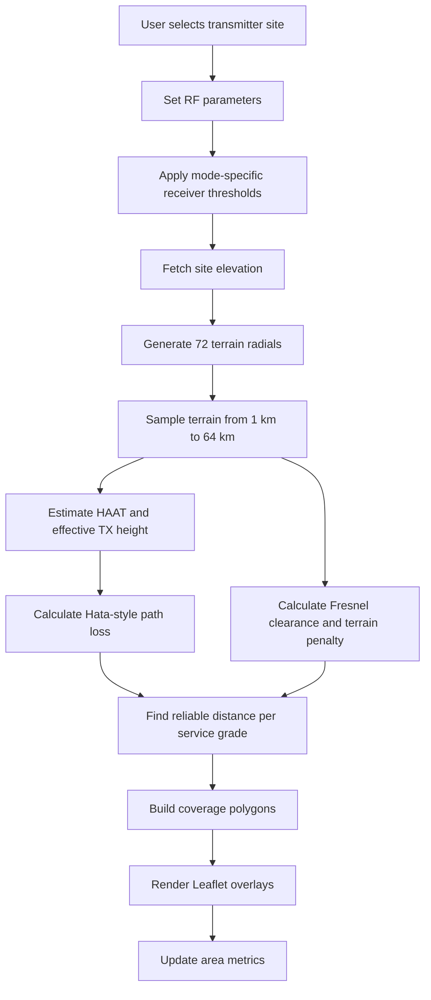

<p align="center">
  
</p>

<h1 align="center">9M2PJU Coverage Prediction</h1>

<p align="center">
  <strong>Multi-Site Terrain-Aware RF Coverage Prediction for Amateur Radio</strong>
</p>

<p align="center">
  
  
  
  
</p>

<p align="center">
  
  
  
  
  
</p>

---

## Overview

**9M2PJU Coverage Prediction** is a browser-based RF coverage planning tool for amateur radio operators. It predicts practical signal coverage from one or more transmitter sites by combining radio path loss, transmitter parameters, antenna height, receiver height, terrain elevation, and map-based visualization.

[**Launch v4.3 Dashboard**](https://coverage.hamradio.my)

The app is designed for fast field planning: choose a transmitter location, adjust RF parameters, run the prediction, and inspect the expected strong, moderate, and fringe coverage zones directly on a map.

It uses Hata-style path loss plus sampled terrain/Fresnel obstruction, so it should give useful approximate coverage zones, but real-world results can differ due to buildings, foliage, antenna pattern, local noise, receiver quality, weather, and terrain data accuracy.

---

## What Changed in v4.3

- Renamed the app to **9M2PJU Coverage Prediction**.
- Updated the subtitle to **Multi-Site Coverage Prediction v4.3**.
- Added support for up to 4 transmitter coverage sites.
- Added combined coverage metrics across all active sites.
- Added multiple base map layers while keeping standard OpenStreetMap as the default.
- Improved the RF prediction model with receiver height, effective antenna height, HAAT, terrain clearance, and diffraction-style loss.
- Reworked the mobile and desktop layout for better browser compatibility.
- Added PWA metadata and offline app-shell caching for install support on mobile and desktop browsers.
- Fixed generated bundle linting by excluding deployed `docs/` output from ESLint.
- Updated project metadata to version `4.3.0`.

---

## Main Features

### Multi-Site Prediction

The app can model multiple transmitter sites in the same planning session. Each site has:

- A map marker position.
- Site elevation.
- HAAT estimate.
- Strong, moderate, and fringe coverage polygons.
- Individual area totals.

The dashboard also shows combined area totals across all sites. At the moment, these totals are summed per site, so overlapping coverage is counted more than once.

### Terrain-Aware Coverage

The prediction does more than draw a simple radius circle. For each transmitter site, the app samples terrain in 72 radial directions and evaluates signal reach along each radial. Terrain that intrudes into the signal path adds a penalty, reducing coverage in blocked directions.

### RF Controls

The model responds to:

- Mode profile, including FM voice, APRS/packet, SSB/weak signal, and LoRa SF7/SF9/SF12 presets.
- TX power from 0.1 W to 100 W.
- Antenna gain in dBi.
- Receiver height above ground.
- Frequency band and exact frequency.
- Tower height above ground from 0 m to 100 m.
- Site elevation and surrounding terrain.

### Map Layers

Standard OpenStreetMap is the default base layer. The layer switcher also includes:

- OpenStreetMap Humanitarian.
- OpenTopoMap Terrain.
- Esri World Imagery.
- Carto Dark.

---

## How Prediction Works

The prediction flow is:



### 1. Terrain Sampling

For each transmitter site, the app generates 72 bearings around the site. Along each bearing it samples terrain at:

`1, 2, 4, 6, 8, 10, 12, 16, 24, 32, 48, and 64 km`

Elevation data is fetched from the Open-Elevation API in batches.

### 2. HAAT and Effective Height

The app estimates Height Above Average Terrain using the sampled terrain around the transmitter. It then derives an effective transmitter height from:

```text
effective height = tower height + positive HAAT contribution
```

This makes a hilltop site behave differently from a site surrounded by higher terrain.

### 3. Path Loss

The base RF model uses an Okumura-Hata style suburban path loss calculation:

```text
Lb = 69.55 + 26.16 log10(f) - 13.82 log10(hTx)
     - a(hRx) + [44.9 - 6.55 log10(hTx)] log10(d)
```

Where:

- `f` is frequency in MHz.
- `hTx` is effective transmitter height in meters.
- `hRx` is receiver height in meters.
- `d` is distance in kilometers.
- `a(hRx)` is the receiver height correction factor.

The implementation also applies a suburban correction and a simple extension for higher UHF/SHF frequencies.

### 4. Terrain Penalty

For each candidate distance, the app checks sampled terrain along the path:

- It estimates the line-of-sight height between transmitter and receiver.
- It estimates first Fresnel zone clearance.
- If terrain violates the required clearance, it applies a diffraction-style loss penalty.
- Multiple obstructed samples add extra shadowing loss.

This creates shorter coverage in blocked directions and longer coverage in clearer directions.

The first Fresnel zone radius is calculated in meters with frequency in MHz:

```text
F1 = 548 sqrt(d1 d2 / (f D))
```

Where:

- `d1` and `d2` are the path segment distances in kilometers.
- `D` is the full path distance in kilometers.
- `f` is frequency in MHz.

The model expects at least 60% of the first Fresnel zone to be clear. If terrain violates that clearance, it applies a knife-edge diffraction-style loss:

```text
v = h sqrt(2 (d1 + d2) / (lambda d1 d2))
J(v) = 6.9 + 20 log10(sqrt((v - 0.1)^2 + 1) + v - 0.1)
```

Where `h` is the clearance deficit in meters, `lambda` is wavelength in meters, and `d1`/`d2` are converted to meters for the diffraction calculation. The app also adds a small extra shadowing penalty for multiple obstructed terrain samples.

### 5. Mode Profiles and Service Grade Thresholds

The app searches for the maximum distance where total loss stays under each mode-specific service-grade budget. FM voice keeps the original practical voice-planning thresholds:

| Grade | Threshold | Typical Use |
| :--- | :--- | :--- |
| Strong | > -93 dBm | Handheld / reliable audio |
| Moderate | > -105 dBm | Mobile / usable field coverage |
| Fringe | > -115 dBm | Weak signal / base station reception |

Other profiles replace those thresholds with receiver-sensitivity-oriented values. LoRa presets model SF7, SF9, and SF12 at 125 kHz bandwidth by using deeper fringe thresholds and stronger signal-margin bands:

| Mode | Strong | Moderate | Fringe |
| :--- | :--- | :--- | :--- |
| APRS / Packet | > -100 dBm | > -108 dBm | > -116 dBm |
| SSB / Weak Signal | > -105 dBm | > -115 dBm | > -123 dBm |
| LoRa SF7 125k | > -103 dBm | > -113 dBm | > -123 dBm |
| LoRa SF9 125k | > -109 dBm | > -119 dBm | > -129 dBm |
| LoRa SF12 125k | > -117 dBm | > -127 dBm | > -137 dBm |

Each grade becomes a polygon built from the predicted distance in each radial direction.

### 6. Formula Audit and Reliability

The current formula set is suitable for comparative planning and field pre-checks, not for certified RF engineering sign-off. The calculation path has been checked for unit consistency and now uses the correct MHz form of the first Fresnel radius formula.

What is considered reliable enough for planning:

- TX power is converted with `Ptx dBm = 10 log10(Pwatts * 1000)`.
- Antenna gain is added directly to the link budget as dBi.
- Coverage is found where `path loss + terrain penalty` stays below `Ptx dBm + antenna gain - receiver threshold`.
- The Hata-style suburban path loss equation matches the common Okumura-Hata form and suburban correction.
- The terrain penalty uses line-of-sight clearance, 60% first Fresnel clearance, and a knife-edge diffraction-style loss approximation.
- LoRa, APRS, SSB, and FM profiles are modeled by changing receiver threshold/link-margin bands, not by changing the propagation physics.

Known reliability limits:

- Okumura-Hata is empirical. It is strongest for macro-style outdoor links, not indoor handheld operation or street-canyon/building-level prediction.
- The original Hata model is normally bounded around 150-1500 MHz, base antenna heights around 30-200 m, mobile heights around 1-10 m, and moderate link distances. This app extends the idea for amateur planning across 30-3000 MHz and clamps antenna heights internally to keep the math stable.
- The UHF/SHF extension is a practical approximation, not a full ITU-R P.1546, Longley-Rice/ITM, or ray-tracing implementation.
- Terrain is sampled at fixed radial distances out to 64 km. Predictions beyond that distance still run, but distant terrain detail is less complete.
- The LoRa presets use typical sensitivity-style thresholds for SF7/SF9/SF12 at 125 kHz. Real LoRa reliability also depends on bandwidth, coding rate, payload length, interference, duty cycle, receiver implementation, and local regulations.
- Feedline loss, receiver antenna gain, polarization mismatch, foliage, buildings, noise floor, interference, weather, and antenna radiation patterns are not fully modeled.

For critical deployments, use this tool to choose candidate sites and then validate with field measurements or a regulatory-grade RF planning package.

---

## Notes and Limitations

- This is a planning and prediction tool, not a certified engineering survey.
- Open-Elevation API availability and CORS behavior can affect local development.
- Buildings, foliage, antenna pattern nulls, feedline loss, polarization mismatch, and local noise floor are not fully modeled.
- Combined multi-site totals currently sum each site's area and do not perform polygon union/deduplication.
- Real-world validation with field measurements is still recommended.

---

## Technology Stack

- **Core**: React, Vite
- **Mapping**: Leaflet, React-Leaflet
- **Elevation Data**: Open-Elevation API
- **UI**: Vanilla CSS, responsive desktop/mobile layout
- **Icons**: Lucide React
- **Deployment**: GitHub Pages via `docs/`

---

<p align="center">
  
  <br>
  Built for the Amateur Radio Community by <b>9M2PJU</b>
  <br>
  <a href="https://github.com/9M2PJU">GitHub Profile</a>
</p>
