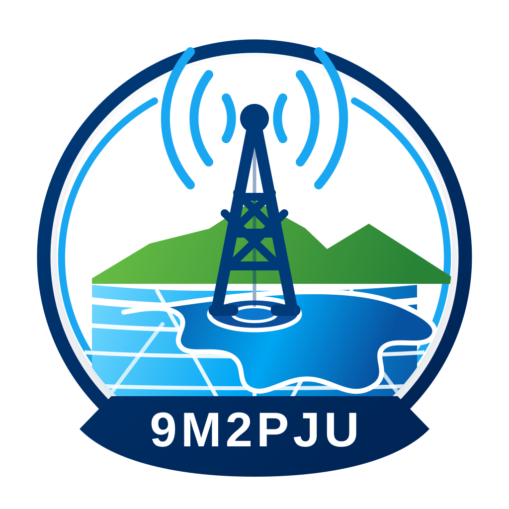

  

<h1 align="center">9M2PJU Coverage Prediction</h1>

  <strong>Terrain-aware amateur radio coverage prediction for operator planning</strong>

  
  
  

## Current Status

**9M2PJU Coverage Prediction v4.9.0** is a usable planning tool for amateur radio operators. It is suitable for repeater/site planning, coverage comparison, and operator-level “will this likely work?” studies.

It should not be described as certified RF engineering software. Prediction quality still depends on terrain data, ITM service availability, antenna gain/installation, clutter, local noise, receiver performance, and real-world signal conditions.

The default model uses the 9M2PJU **ITS Irregular Terrain Model (ITM) / Longley-Rice** helper service. If the service or native engine is unavailable, the app reports that status and can continue with local terrain-aware fallback logic.

## What It Does

- Predicts strong, moderate, and fringe amateur-radio coverage zones.
- Supports up to four transmitter sites.
- Estimates overlap-aware combined coverage area.
- Covers VHF, UHF, and SHF planning from 30 MHz to 30 GHz.
- Samples terrain for elevation, HAAT, effective antenna height, curvature/refraction, Fresnel clearance, and diffraction-style terrain penalties.
- Uses ITM radial sampling and per-cell raster ITM when the helper service supports it.
- Falls back to local terrain-aware models when ITM is unavailable.
- Supports FM voice, APRS/packet, SSB/weak-signal, and LoRa profiles.
- Includes TX/RX antenna gain, TX/RX line loss, receiver threshold, fade margin, max range, ITM reliability, ITM confidence, clutter, two-ray, rain, and atmospheric controls.
- Exports GeoJSON, PDF, setup JSON, and share links.

## Planning Tools

The interface keeps the main workflow focused on operator planning:

- Prediction trust status for each active site.
- Receiver-threshold or noise-floor threshold mode.
- Adjustable raster cell size.
- Place site and check point map modes.
- Quick presets for handheld, mobile, base, repeater, LoRa, and microwave stations.
- Terrain profile sparkline for queried points.
- Setup save/load and shareable links.
- PDF map snapshots with coverage overlay, legend, north arrow, and scale reference.

These tools make the app easier to use for everyday radio planning. They do not magically make every prediction correct; they make assumptions visible so operators can choose sensible values.

## Reliability

For amateur-radio planning, this app is now reliable and usable when the operator understands its limits:

- Best used for outdoor VHF/UHF planning, repeater/site comparison, and coverage expectations.
- More trustworthy when ITM is reachable and terrain data is available.
- Less trustworthy for indoor coverage, dense city streets, heavy foliage, receiver desense, local interference, SHF availability, and building-level blockage.

Treat the map as a planning estimate. For important coverage promises, compare with real signal reports or measured RSSI points outside the app.

## Exports

- **GeoJSON**: coverage polygons, site points, RF settings, thresholds, render mode, raster metadata, and prediction status.
- **PDF**: human-readable result report with map snapshot, coverage totals, RF settings, prediction settings, site details, and thresholds.
- **Setup JSON**: repeatable site and settings bundle.

## License

This project is licensed under the **GNU Affero General Public License v3.0 or later**. See `LICENSE` for the full license text.

---

  
   
  Built for the Amateur Radio Community by <b>9M2PJU</b>
   
  <a href="https://github.com/9M2PJU">GitHub Profile</a>

