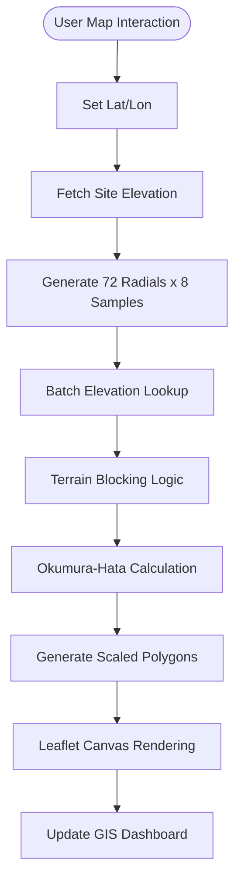

  

<h1 align="center">9M2PJU PRO SIGNAL v4.1</h1>

  <strong>Professional Terrain-Aware RF Analysis Dashboard for Amateur Radio</strong>

  
  
  

  
  
  
  
  

---

## 📡 The Gold Standard for Field Coverage

**9M2PJU PRO SIGNAL** is a high-performance, terrain-aware coverage engine designed for the modern radio amateur. Unlike simple radius circles, our engine calculates **terrain shadowing** and **topographic blocking** in real-time to provide a realistic map of where your signal truly lands.

[**Launch v4.1 Dashboard 🚀**](https://coverage.hamradio.my)

---

## ✨ Advanced Features

### 🏔️ Precision Terrain Shadowing
The engine utilizes a 72-radial sampling grid to fetch real-time topographic data via the **Open-Elevation API**. It calculates path loss and terrain blocking (Knife-Edge diffraction) to simulate "signal bleeding" and "dead zones" accurately.

### 📱 Native Mobile Experience (v4.1)
Optimized for smartphones with a **Native App UI**:
- **Bottom Sheet Paradigm**: Swipe-up settings menu for maximum map visibility.
- **Floating Scan Button**: Dedicated FAB for rapid field analysis.
- **Haptic-Ready Metrics**: Large, touch-friendly cards for area statistics.

### 📶 Multi-Band RF Performance
- **30 MHz - 3.0 GHz Support**: Integrated band selector for VHF, UHF, and SHF.
- **HAAT Auto-Estimation**: Automatically calculates Height Above Average Terrain based on local topography.
- **Service Grade Matrix**: Real-time KM² calculation for three signal tiers.

---

## 📊 RF Service Grades

| Grade | Signal Level (dBm) | Reliability | Usage Context |
| :--- | :--- | :--- | :--- |
| **Grade A** | > -93 dBm | 95% + | Handheld (HT) / Solid Audio |
| **Grade B** | > -105 dBm | 70% | Mobile / Occasional Flutter |
| **Fringe** | > -115 dBm | < 50% | Base Station / High-Gain Ant |

---

## 🔬 Mathematical Model

The coverage engine employs the **Okumura-Hata Model** (Suburban implementation) to calculate median path loss. This is the industry standard for predicting signal propagation in built-up and mixed terrain environments.

### 📉 Path Loss Formula
The median path loss $L_b$ (dB) is calculated as:
$$L_b = 69.55 + 26.16 \log_{10}(f) - 13.82 \log_{10}(h_{tx}) - a(h_{rx}) + [44.9 - 6.55 \log_{10}(h_{tx})] \log_{10}(d)$$

**Parameters:**
- $f$ : Frequency (MHz), optimized for $30 - 3000$ MHz
- $h_{tx}$ : Effective height of the transmitter antenna (m)
- $h_{rx}$ : Height of the receiver antenna (m)
- $d$ : Distance from transmitter to receiver (km)
- $a(h_{rx})$ : Receiver antenna correction factor

### 🏔️ Terrain & Diffraction
1. **HAAT Calculation**: The Height Above Average Terrain is calculated by sampling 8 points along each of the 72 radials to determine the local mean elevation.
2. **Knife-Edge Shadowing**: When terrain exceeds the theoretical Line-of-Sight (LoS) path, the engine applies a **Lee-Approximate Shadowing Penalty** to simulate signal diffraction over ridges and obstacles.

---

## 🏗️ System Architecture

---

## 🛠️ Technology Stack

- **Core**: React 18, Vite
- **GIS**: Leaflet, Open-Elevation API
- **Design**: Vanilla CSS with Glassmorphism & Mobile-Native components
- **Logic**: Custom Hata-Okumura terrain-blocking implementation
- **Icons**: Lucide-React

---

  
   
  Built for the Amateur Radio Community by <b>9M2PJU</b>
   
  <a href="https://github.com/9M2PJU">GitHub Profile</a>

