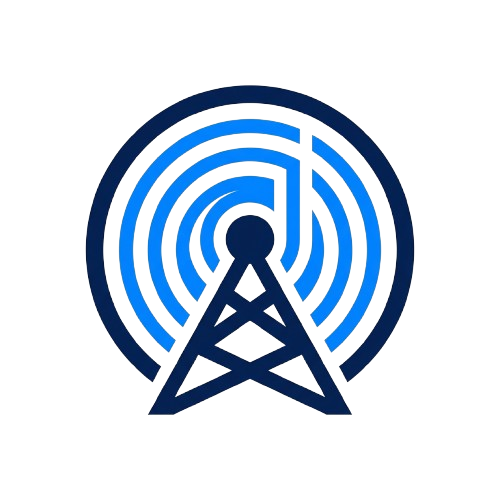
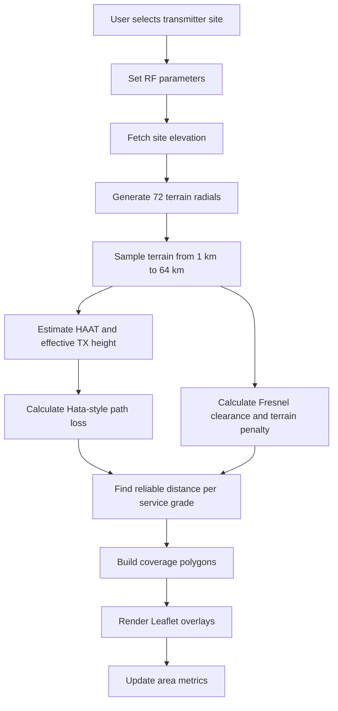

<p align="center">
  
</p>

<h1 align="center">9M2PJU Coverage Prediction</h1>

<p align="center">
  <strong>Multi-Site Terrain-Aware RF Coverage Prediction for Amateur Radio</strong>
</p>

<p align="center">
  
  
  
  
</p>

<p align="center">
  
  
  
  
  
</p>

---

## Overview

**9M2PJU Coverage Prediction** is a browser-based RF coverage planning tool for amateur radio operators. It predicts practical signal coverage from one or more transmitter sites by combining radio path loss, transmitter parameters, antenna height, receiver height, terrain elevation, and map-based visualization.

[**Launch v4.3 Dashboard**](https://coverage.hamradio.my)

The app is designed for fast field planning: choose a transmitter location, adjust RF parameters, run the prediction, and inspect the expected strong, moderate, and fringe coverage zones directly on a map.

---

## What Changed in v4.3

- Renamed the app to **9M2PJU Coverage Prediction**.
- Updated the subtitle to **Multi-Site Coverage Prediction v4.3**.
- Added support for up to 4 transmitter coverage sites.
- Added combined coverage metrics across all active sites.
- Added multiple base map layers while keeping standard OpenStreetMap as the default.
- Improved the RF prediction model with receiver height, effective antenna height, HAAT, terrain clearance, and diffraction-style loss.
- Reworked the mobile and desktop layout for better browser compatibility.
- Fixed generated bundle linting by excluding deployed `docs/` output from ESLint.
- Updated project metadata to version `4.3.0`.

---

## Main Features

### Multi-Site Prediction

The app can model multiple transmitter sites in the same planning session. Each site has:

- A map marker position.
- Site elevation.
- HAAT estimate.
- Strong, moderate, and fringe coverage polygons.
- Individual area totals.

The dashboard also shows combined area totals across all sites. At the moment, these totals are summed per site, so overlapping coverage is counted more than once.

### Terrain-Aware Coverage

The prediction does more than draw a simple radius circle. For each transmitter site, the app samples terrain in 72 radial directions and evaluates signal reach along each radial. Terrain that intrudes into the signal path adds a penalty, reducing coverage in blocked directions.

### RF Controls

The model responds to:

- TX power in watts.
- Antenna gain in dBi.
- Receiver height above ground.
- Frequency band and exact frequency.
- Tower height above ground.
- Site elevation and surrounding terrain.

### Map Layers

Standard OpenStreetMap is the default base layer. The layer switcher also includes:

- OpenStreetMap Humanitarian.
- OpenTopoMap Terrain.
- Esri World Imagery.
- Carto Dark.

---

## How Prediction Works

The prediction flow is:



### 1. Terrain Sampling

For each transmitter site, the app generates 72 bearings around the site. Along each bearing it samples terrain at:

`1, 2, 4, 6, 8, 10, 12, 16, 24, 32, 48, and 64 km`

Elevation data is fetched from the Open-Elevation API in batches.

### 2. HAAT and Effective Height

The app estimates Height Above Average Terrain using the sampled terrain around the transmitter. It then derives an effective transmitter height from:

```text
effective height = tower height + positive HAAT contribution
```

This makes a hilltop site behave differently from a site surrounded by higher terrain.

### 3. Path Loss

The base RF model uses an Okumura-Hata style suburban path loss calculation:

```text
Lb = 69.55 + 26.16 log10(f) - 13.82 log10(hTx)
     - a(hRx) + [44.9 - 6.55 log10(hTx)] log10(d)
```

Where:

- `f` is frequency in MHz.
- `hTx` is effective transmitter height in meters.
- `hRx` is receiver height in meters.
- `d` is distance in kilometers.
- `a(hRx)` is the receiver height correction factor.

The implementation also applies a suburban correction and a simple extension for higher UHF/SHF frequencies.

### 4. Terrain Penalty

For each candidate distance, the app checks sampled terrain along the path:

- It estimates the line-of-sight height between transmitter and receiver.
- It estimates first Fresnel zone clearance.
- If terrain violates the required clearance, it applies a diffraction-style loss penalty.
- Multiple obstructed samples add extra shadowing loss.

This creates shorter coverage in blocked directions and longer coverage in clearer directions.

### 5. Service Grade Thresholds

The app searches for the maximum distance where total loss stays under each service-grade budget:

| Grade | Threshold | Typical Use |
| :--- | :--- | :--- |
| Strong | > -93 dBm | Handheld / reliable audio |
| Moderate | > -105 dBm | Mobile / usable field coverage |
| Fringe | > -115 dBm | Weak signal / base station reception |

Each grade becomes a polygon built from the predicted distance in each radial direction.

---

## Notes and Limitations

- This is a planning and prediction tool, not a certified engineering survey.
- Open-Elevation API availability and CORS behavior can affect local development.
- Buildings, foliage, antenna pattern nulls, feedline loss, polarization mismatch, and local noise floor are not fully modeled.
- Combined multi-site totals currently sum each site's area and do not perform polygon union/deduplication.
- Real-world validation with field measurements is still recommended.

---

## Local Development

Install dependencies:

```bash
npm install
```

Run the development server:

```bash
npm run dev
```

Run lint:

```bash
npm run lint
```

Build the GitHub Pages output:

```bash
npm run build
```

The production build is written to `docs/`.

---

## Technology Stack

- **Core**: React, Vite
- **Mapping**: Leaflet, React-Leaflet
- **Elevation Data**: Open-Elevation API
- **UI**: Vanilla CSS, responsive desktop/mobile layout
- **Icons**: Lucide React
- **Deployment**: GitHub Pages via `docs/`

---

<p align="center">
  
  <br>
  Built for the Amateur Radio Community by <b>9M2PJU</b>
  <br>
  <a href="https://github.com/9M2PJU">GitHub Profile</a>
</p>
